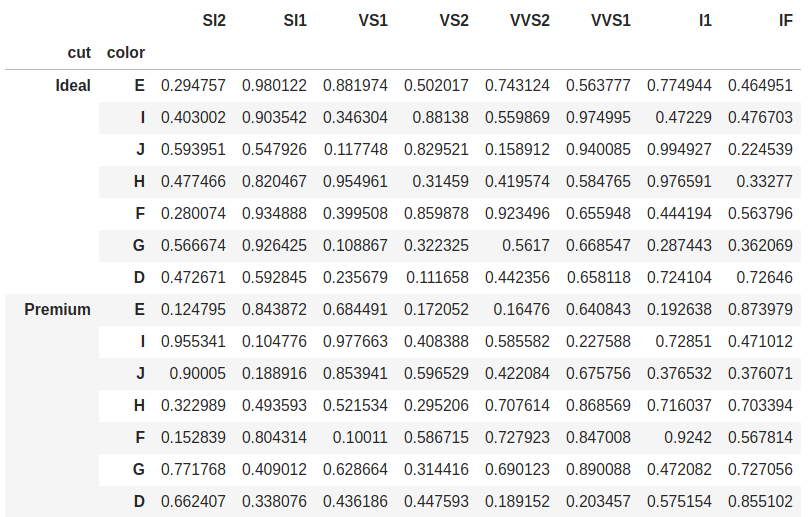
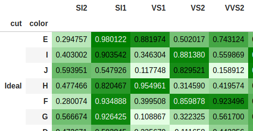
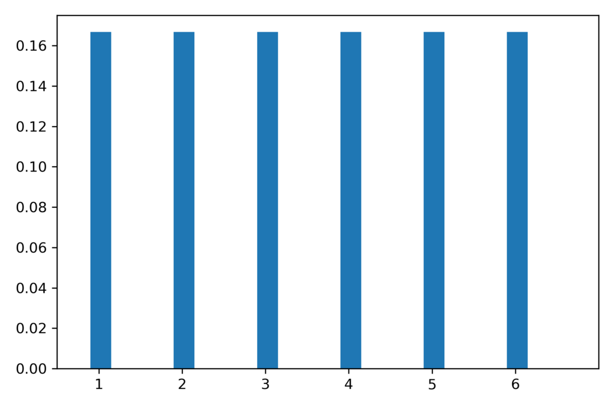
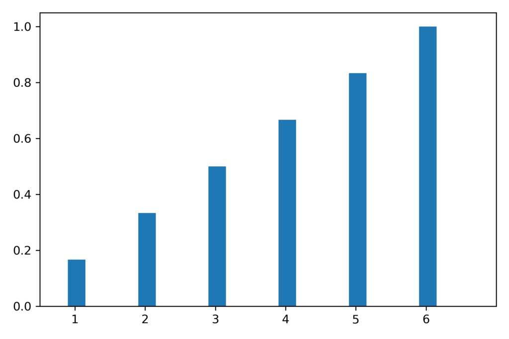
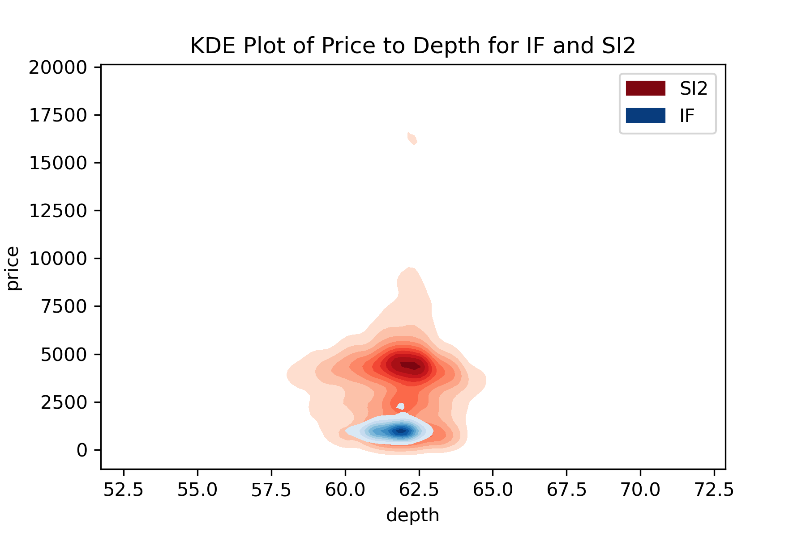

```python

```

# MCIS6273 Data Mining (Prof. Maull) / Fall 2020 / HW1

**This assignment is worth up to 20 POINTS to your grade total if you complete it on time.**

| Points <br/>Possible | Due Date | Time Commitment <br/>(estimated) |
|:---------------:|:--------:|:---------------:|
| 20 | Wednesday, Sep 23 @ Midnight | _up to_ 20 hours |


* **GRADING:** Grading will be aligned with the completeness of the objectives.

* **INDEPENDENT WORK:** Copying, cheating, plagiarism  and academic dishonesty _are not tolerated_ by University or course policy.  Please see the syllabus for the full departmental and University statement on the academic code of honor.

## OBJECTIVES
* Perform Exploratory Data Analysis (EDA) and apply basic statistical concepts to understand the underlying data

* Explore PDF and CDF with Pandas and Seaborn

* Explore distance and similarity measures in Pandas and Scikit-learn

## WHAT TO TURN IN
You are being encouraged to turn the assignment in using the provided
Jupyter Notebook.  To do so, make a directory in your Lab environment called
`homework/hwN`.   Put all of your files in that directory.  Then zip that directory,
rename it with your name as the first part of the filename (e.g. `maull_hwN_files.zip`), then
download it to your local machine, then upload the `.zip` to Blackboard.

If you do not know how to do this, please ask, or visit one of the many tutorials out there
on the basics of using zip in Linux.

If you choose not to use the provided notebook, you will still need to turn in a
`.ipynb` Jupyter Notebook and corresponding files according to the instructions in
this homework.

## ASSIGNMENT TASKS
### (35%) Perform Exploratory Data Analysis (EDA) and apply basic statistical concepts to understand the underlying data 

As we talked in the lecture, there are a number of basic statistical concepts we must understand
in order to uncover patterns in data, from measures of centrality to measures of similarity.

We are going to dive right into a dataset to perform some exploratory data analysis or EDA, with our
eye on uncovering some patterns in the data.  We will try to apply some of the concepts we learned
about the basics of the statistical notions and then move into some more interesting questions and
visualizations that will help us explore further.

The dataset up for this task is a small dataset of diamonds that can be found on Github.  You can
find the dataset in it's raw CSV form here:

* [https://git.io/JUGqS](https://git.io/JUGqS)

In it you will find nearly 54000 diamonds with 10 features -- _cut, clarity, color, carat, depth, table, price,
x, y_ and _z_.  If you would like to learn a little more about how diamonds are graded you may review this
gemological resource: [https://www.gemologyonline.com/diamondgrading.html](https://www.gemologyonline.com/diamondgrading.html) which will give you some insight
into some of the broad characteristics of diamonds that gemologists inspect.  While there are many controversies surrounding
the way in which diamonds are extracted and priced, our goal at this point is to just explore the
prices of diamonds in this dataset.

In this part of the assignment, we are going to explore this dataset using Pandas to initially load
the CSV file and then we will dig into the data a bit more, first exploring the numerical features.

This is going to be fun, if not a bit challenging, as we will exercise some of the feautures of
[`Pandas`](), [`Numpy`]() and [`statsmodels`]().

&#167;  In the first task, we are going to load the data into a DataFrame using the standard [`pd.read_csv()`](https://pandas.pydata.org/pandas-docs/stable/reference/api/pandas.read_csv.html?highlight=read_csv#pandas.read_csv).
After loading the dataset, answer the following basic questions using the data:

1. What is the median price of a diamond over the entire dataset?
1. What is the mean?
1. Of the diamonds between 1.50 and 3 carats, what is the median price?
1. How many _Premium_ cut diamonds with _VVS1_, _I1_ and _IF_ clarity are there (regardless of color)?
1. For diamonds between $3500-$7000, what is the mean carat size?


&#167;  Now that we have some warmups out of the way, let's learn a little about `MultiIndex` in Pandas.
Often we are confronted with data that may benefit from a different arrangment of the data in
the DataFrame.  Concretely, imagine you are building a table for the participants in a marathon.
Often marathons group runners into age groups, sometimes runners are grouped by sex, and other times
runners may be grouped by country and even competitive or non-competitive groups.  Clearly, when
looking at the data, we might like to see the data broken down into a hierarchy of those groups --
we might want to traverse all Male, competitive, age 30-40 runners from Greece into a table.

The visual value of this cannot be overstated -- clearly writing queries against such data is
important, but so is being able display this data in a form that it can be communicated to others
in a tabular form. This is where Pandas [`MultiIndex`](https://pandas.pydata.org/pandas-docs/stable/reference/api/pandas.MultiIndex.html?highlight=multiindex#pandas.MultiIndex) comes into play.  You will want to read
up on this in order to perform the next task and to answer the following questions.  Before you answer
the questions, make sure your indices are as follows:

* in your Multindex DataFrame  the row indices are nested with _cut_ in the outer index, _color_ in the inner index.
* the columns will be the _clarity_
* the values for a given `(cut, color, clarity)` will the _mean_ value for that combination.  For example,
if you were to go into the data and select all _Ideal cut_, _E color_, _SI1 clarity_ diamonds and computed the
_mean_, you would insert that into the table for that multi-index and column.  HINT: don't overthink this step
as the multi-index, column can be accessed with something like `.loc[ (cut, color), clarity]` and you can just set
the value to the mean for all the rows meeting that criterion from the origin imported table.  You WILL have to
create a new DataFrame -- do not try to replace the original imported DataFrame in-place.  This will not go well.
* your DataFrame will look something like Figure 1 below.



1. Please make sure you output the multi-index DataFrame so that I can see it


&#167;  Now that you have the DataFrame. there is one last thing to do so that you can answer some more
interesting questions.

Pandas provides an interesting and simple way to stylize the background of your table to print it
as a kind of heatmap.  Based on the values, different cells will take on different colors.  To save
you some time, you can use the following code snippets to print out your data with a more useful color coding:

```python
   import seaborn as sns

   cm = sns.light_palette("green", as_cmap=True)
   df_multi_idx.astype('float').style.background_gradient(cmap=cm)
```

where `df_multi_idx` is the your multi-index DataFrame.  It will look something like Figure 2 below and you
will agree it is a great improvement over the original.  NOTE: you are free to play with a palette other
than green, since the example code is just that and you can modify it to your liking.


Now answer the following questions:

1. If we are looking at _J color, Ideal cut_ diamonds, what seems unusual about the _I1 clarity_ mean price?
   Recall, _J color_ are considered the color right before faint yellow and are considered the least
   quality color rating.
1. Can you make a general observation about the average prices trends?  What are you noticing, especially about
   the average prices as the color gets worse?
1. Which _cut, color_ and _clarity_ has the highest overall mean price?




&#167;  Now that you have seen a trend on prices, instead of computing the mean price, compute the mean carat
size of the diamond and perform the same tabular gradient enhancement.  Answer the following questionsn
looking at the tables you've generated:

1. What seems to be the trend in carat size, especially as it relates to cut and color?
1. Which cut (regardless of color) has the largest mean carat size?  Is this a surprising outcome?
   Explain in a sentence or two what you think is going on?

Plot a scatterplot of all the raw data with price on the $y$-axis and carats on the $x$-axis using
this as a template:

```python
     your_dataframe.loc[:,['price','carat']].plot(kind='scatter', x='carat', y='price')
```

1. Does your plot support the claim that price increases as carats increase?


### (35%) Explore PDF and CDF with Pandas and Seaborn 

In the readings and in the lecture there were introductory notions of frequency measures.  Specifically, we
are interested in  concepts
relating to the probability of obtaining values in a given distribution.

Any emperical observations can be plotted in terms of the frequency of their observations.  For example, when looking
at the number of customers arriving at a restuarant, we often _bin_ the arrivals by hour.  Doing so allows
us to see how many customers come in over a range of hours allowing a business owner or analyst to
prepare food, have employees available to work when the arrivals peak or put other business policies in place
to provide a more pleasant experience for the customers.

We most often see these plots as _histograms_, and in the case of arrival times by hour, the
number of bins in which we'd divide the histogram would be the number of hours the restaurant would be open and
would thus show the aggregate number of customer arrivals each hour of operation.

Histograms naturally lead us to explore frequencies as probabilities.  Indeed, we might like to understand
the probability of 10 customers arriving in an hour, or the probability of more than a certain number of
customers.  For example, the probability of more than 20 customers arriving might tell us something interesting
about the peak load of customers, etc.  You will note that we have mostly been talking about _discrete_ variables
-- that is variables that are countable and finite.

A typical example is the probability of the outcomes of a fair dice. The 6-sided dice has only 6 outcomes, the 8-sided, only
8 outcomes and so on.  Thus, we are dealing with a discrete function and so if we let $X$ be an event space, and $x$
the outcome of the event (roll of a die)
$x \in X = \{ 1, 2, 3, 4, 5, 6 \}$ then the _probability mass function_ is:

$$
\Pr(X=x) = \left\{
\begin{array}{lr}
\frac{1}{6} & x = 1\\
\frac{1}{6} & x= 2\\
\frac{1}{6} & x= 3\\
\frac{1}{6} & x= 4\\
\frac{1}{6} & x= 5\\
\frac{1}{6} & x= 6\\
\end{array}
\right.
$$

The histogram for that function is given by:



And you can see rolling a fair dice takes on the same probability for all events, thus is it called a _discrete uniform distribution_.

The last concept is to develop is that of the of the _cumulative distribution function_ or CDF.  Instead of the probability
of a specific value, we look at the _cumulative_ probability  at a given value or below.  The output of the CDF
the probability of obtaining that value or less or $\Pr(X \le x)$.  As you would imagine,
the CDF grows until it eventually reaches 1.0 -- that is all values at or below that value have a probability of
1.

CDFs are interesting to explore and compare, which is exactly what we would like to do with the diamond data.
In fact, by comparing CDFs, we can learn a lot about how two distributions compare with one another and
it is an important tool in developing an undestanding of how the underlying data of two distinct datasets
might vary.


To be more concrete, let's look at the trivially simple plot of the CDF for a fair dice.




Similar concepts apply to continous random variables, but we'll stick with the discrete case for this part of the
assignment.

&#167;  We want to explore our intuition of the diamonds through the lens of PMF and CDF, so first we're going to
use a very valuable library called [Seaborn](https://seaborn.pydata.org/) to get a feel for the data and confirm some intuitions.

The first thing want to do is look at the cumulative distribution of one variables -- _carat_.  Our
intuition is that different clarities have different carat distributions in the data.  For example, we might
expect that the lower the clarity, the more distrubuted the carat.  Stated another way, we might find
more variability in carat sizes as the clarity gets worse.  Let's look at two ends of the spectrum --
the flawless ("FL") and internally flawlss ("IF") and the opposite end the slightly included "SI2" and "SI3" clarity
diamonds.  To get started, let's take a look at the distribution of diamond clarity.

1. Produce a count of the diamond clarities using the [`pandas.DataFrame.value_counts()`](https://pandas.pydata.org/pandas-docs/stable/reference/api/pandas.DataFrame.value_counts.html?highlight=value_counts#pandas.DataFrame.value_counts)
   method.  Show the
   count of diamonds on a bar graph using [`plot(kind="bar")`](https://pandas.pydata.org/pandas-docs/stable/reference/api/pandas.DataFrame.plot.html?highlight=plot#pandas.DataFrame.plot).
2. What observation can you make about the trend in the count of diamonds in each clarity category?
3. How do the numbers of diamonds in the "SI" and "IF/FL" groups compare?


&#167;  Now that we have an understanding of how many diamonds we have in each clarity group, let's compare the
distribution of carats for each.  To do this we are going to turn to Seaborn's `distplot()` method.
Read about `distplot()` [here](https://seaborn.pydata.org/generated/seaborn.distplot.html#seaborn.distplot), but
this template of code should help you plot what you need:

```python
    import seaborn as sns
    import matlplotlib.pyplot as plt

    plt.title("Comparing Cumulative Distribution of Carat for I1, IF, SI1 and SI2")

    kwargs = {'cumulative': True}

    sns.distplot(the_dataframe_with_clarity_X, hist=False, hist_kws=kwargs, kde_kws=kwargs, label="clarity_X")
    # repeat for the other clarities you want compare

```

You now have a cumulative distribution for each clarity.  You will be reminded that the $y$-axis shows us
the cumulative probability while the $x$-axis shows us the carat sizes.  The smoothed curve shows the density
of the carat for a given probability and uses a smoothing technique called _kernel density estimate_.
After displaying the plot from the
code above in your notebook, answer the following questions:

1. Which color has the largest relative distribution of high carat diamonds?
2. Which has the largest relative distribution of small diamonds?
3. Based on the prior two questions, is this a surprising outcome?
4. Which two distributions look most similar?


&#167;  We're now at the point where we'd like to graph this same data in two dimensions, with what is
called the _kernel density estimate plot_ or KDE plot.  The KDE plot takes our bivariate data as input and
outputs a smoothed 2D contour plot.  You see, in the example above, we only showed a single feature of the
data.  While interesting, it is far more interesting when we compare two variables.  Indeed, since
diamonds are generally considered a luxury item, and not typically considered "inexpensive", we might like
to know how _carat_ size influences _price_.  This makes things a bit more interesting and useful.

We're going to use the KDE plot to visually compare the densities of _carat_ and _price_.

```python
    plt.title("KDE Plot of Price to Carat for X and Y")

    # dataset X
    sns.kdeplot(
        x_carat,
        x_price,
        cmap="Reds",
        shade=True,
        shade_lowest=False, label="x_label")

    # dataset Y
    sns.kdeplot(
        y_carat,
        y_price,
        cmap="Blues",
        shade=True,
        shade_lowest=False, label="y_label")

    plt.legend()
    plt.savefig("your_plot_can_be_saved.png")
```

Your plot will look something like that in Figure 3 below.  If you notice in the figure the densities show
that SI2 has a broad distribution between a depth of 58 and 65, while the price varies greatly reaching
well above $10,000.  You can see IF diamonds are much tighter both in terms of price and depth.




You may want to only plot each alone or no more than 2 per plot so you can see the data.
After you have the plots, make sure you save them and include them in your zipped submission.  Then answer the
questions below based on your plots:

1. How do the density plots compare to one another?  What general observation can you make
   about the typical SI1 and SI2 diamonds?  What are their similarities?
2. What about the density plots for I1 and IF?  How are they different?  Please provide
   as much description to support your answer.
3. From the plots alone, what can you make of the price density of 1-carat SI1 diamonds versus those
   of SI2 diamonds?
4. What would you say of the claim: "If clarity is of great concern to you, the your best value diamonds are in
   found in the I1 clarity."?  What challenges could you make to this claim based on the KDE plots?  What
   are the supports for this claim?
5. Write a query using the [`DataFrame.query()`](https://pandas.pydata.org/pandas-docs/stable/reference/api/pandas.DataFrame.query.html)
   method to show the descriptive statistics for _clarity I1_ and _clarity SI1_ diamonds.  You can use the [`DataFrame.describe()`](https://pandas.pydata.org/pandas-docs/stable/reference/api/pandas.DataFrame.describe.html?highlight=describe#pandas.DataFrame.describe)
   method to get the descriptive statistics.  The query method will restrict diamonds between .95 and 1.05 carats
   for each color.
6. Based on that query how can it be used as evidence to support the original claim in question #4 previously?


### (30%) Explore distance and similarity measures in Pandas and Scikit-learn 

In this last exploration we're going to make use of the excellent distance metrics provided with Scikit-learn.
In class we talked about several distance metrics, one of the most useful for numeric data being
Euclidean, defined by: $D_{euclidean}(x, y) = \sqrt{ \sum_i ( x_i -y_i )^2 }$.

We're going to use the `sklearn.metrics` libraries to understand the similarity of certain diamonds to
a reference set I will be giving you.  As we go through this exercise, you'll be building up your intuitions
that will help carry you into  clustering concepts and other methods of data exploration.

First, familiarize yourself with the [`sklearn.metrics.pairwise_distances`](https://Scikit-learn.org/stable/modules/generated/sklearn.metrics.pairwise_distances.html#sklearn.metrics.pairwise_distances) and [`sklearn.preprocessing.normalize`](https://Scikit-learn.org/stable/modules/generated/sklearn.preprocessing.normalize.html?highlight=normalize#sklearn.preprocessing.normalize)
methods.  These will be critical for completing these tasks.  You will also need to read up on the
[`pandas.get_dummies()`](https://pandas.pydata.org/pandas-docs/stable/reference/api/pandas.get_dummies.html?highlight=get_dummies#pandas.get_dummies) method.

In class, I talked a bit about nomimal and categorical versus numeric variables.  Categorical being the the variables that
take on two or more named categories, like "Male" or "Female", or color grades like "E", "G" or "H".  Most
machine learning and data mining algorithms  do not deal with such variables easily as strings and thus we will
often have to convert such variables to numeric or binary values, where 1 represents the presence and 0 the absence
of the variable, or a scale of values like 1 to 10, etc.

Luckily Pandas provides this capability for us with the  [`pandas.get_dummies()`](https://pandas.pydata.org/pandas-docs/stable/reference/api/pandas.get_dummies.html?highlight=get_dummies#pandas.get_dummies) method, which
will automatically convert these categorical and nominal values to binary values.  Sometimes this is also
called _binarizing_ or _binarization_.  What the technique effectively does is map a series of outcome variables
like color grades to numerical indicatator variables -- with a 1 that the variable is present and 0 for all others.
You may notice that this can create very large, and sparse datasets if you have a lot of variable outcomes.

You will need to load the diamonds dataset and convert the categorical variable to numeric (cut, clarity, color).
Once this is done, you will be able to do what will be asked of you.

&#167;  Once you have used `get_dummies()` to create a binary (numeric feature) for the variable's presence or absence
then you can perform more interesting operations such as comparing one set of data to another.

In the interest of being mindful of our computation restrictions on the Hub, we are going to randomly sample
the data in order to develop some distance measures.  There are a number of ways to get a random sample
of rows from our DataFrame, but one of the easiest is the [`DataFrame.sample()`](https://pandas.pydata.org/pandas-docs/stable/reference/api/pandas.DataFrame.sample.html) method,
which will take a parameter _n_ to indicate the size of the random sample.  We will choose 10% of the
total data or 5400 to be nice on the cloud computational resources.  If you run this on your own machine,
you may increase that to a much larger number, say 30%.

Now you will perform a final step -- _normalization_.  Normalization is the process of bringing data values
into a common scale.  Scikit-learn offers two common methods L1-norm and L2-norm.  L1-norm is also known
as the _least absolute deviations_ or _least absolute errors_ method and attempts to minimize $\sum_i |y_i - f(x_i)|$
where $f(x_i)$ is the estimated values for the target $y_i$.  L2-norm is known as _least squares_ and
minimizes $\sum_i (y_i - f(x_i))^2$ or the sum of squares.  Each method has their advantages and disadvantages,
but L2-norm is the stable and computationally efficient default within the `sklearn.preprocessing.normalize()`
method and so we will stay with that default in this part of the exercise.


1. Once the data is normalized and your sample has been made, please save the resulting DataFrame to a CSV file
   called `normalized_datasample_5400k.txt`.  Also make sure the head of this dataset is also displayed in
   your notebook.
2. NOTE: We have  sample data rows [here in `sample_data.csv`](https://github.com/kmsaumcis/mcis6273_f20_datamining/tree/master/homework/hw1/sample_data.csv) for the next questions.  You might find it just as
   easy to insert these data into your original dataset and normalize when answering the questions, but
   there are other ways of doing the same thing.
3. For diamond #2 (the 0.38 carat, Ideal, G, VS1, $759), please find the 5 most similar diamonds from the sample
   set that you have.  You will need to learn to use the [`sklearn.metrics.pairwise_distances`](https://Scikit-learn.org/stable/modules/generated/sklearn.metrics.pairwise_distances.html) method
   obtain the distances and the [`numpy.argsort()`](https://docs.scipy.org/doc/numpy-1.13.0/reference/generated/numpy.argsort.html) method to determine the indices of the 5 closest diamonds.
   Use the default Euclidean metric to perform the distances calculation.
4. Run normalization again, **but drop `price` from the sample before normalizing**.  Find the 5 closest diamonds.
   The price per carat for the diamond we were looking at is $1946.15.  How does this compare with the
   price per carat of the 5 most similar diamonds?  You will obviously need to keep the original dataset in
   order to determine the prices of the 5 most similar that you find.
5. When looking at the top 5, what commonalities do they have with the sample diamond #2?  Differences?
5. Perform the same analysis on diamond #14, (1.13 carat, Ideal, F, VS2, $6283).  Again how does the price
   per carat compare?  Use the data you have as evidence to back up your answer.
6. What are the similarities / differences amongst the top 5?  Please be specific in your answer.
8. Provide a reason (an intuition will do) for dropping the `price` feature from the data?


